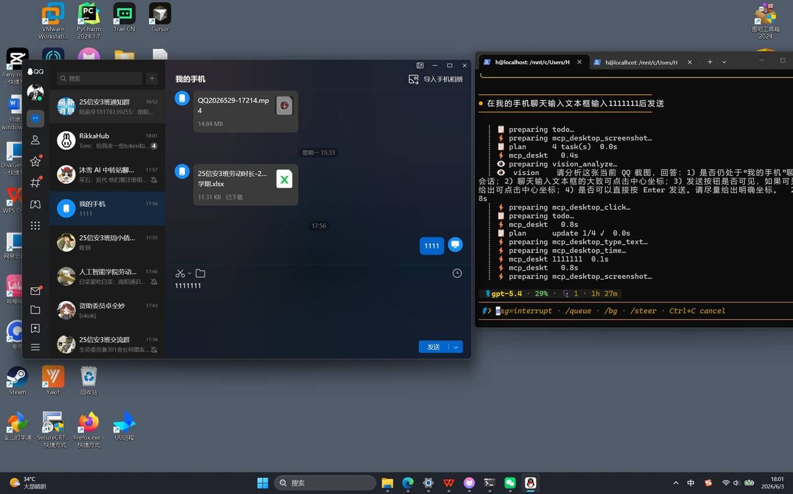
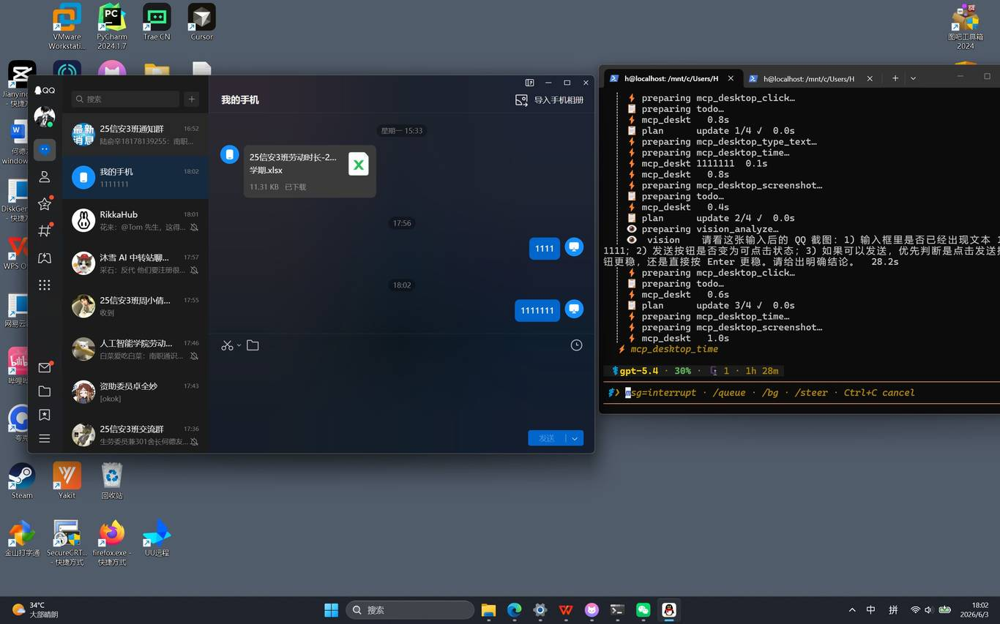

# 测试结果报告

> 生成自: Hermes_RPA方案搭建与测试报告_v2.docx  
> 测试日期: 2026-06-03

## 测试概要

| 模块 | 状态 |
|------|------|
| Windows 桥接 Daemon | ✅ 全部通过 |
| MCP 服务器 (vadgr-cua v0.3.0) | ✅ 21 tools, 全部通过 |
| Hermes MCP 集成 | ✅ 已配置并启用 |
| 截图 (MCP 通道) | ✅ 1366×853 JPEG |
| 截图 (Daemon 直连) | ✅ 2560×1600 JPEG |
| 鼠标操控 | ✅ click, move, double, right |
| 键盘输入 | ✅ type_text, key_press |
| 端到端: QQ 发送消息 | ✅ 全链路验证通过 |

## 详细测试结果

详见 [测试文档](../docs/testing.md)

## 截图

| 阶段 | 截图 |
|------|------|
| QQ 输入确认 |  |
| QQ 发送确认 |  |
